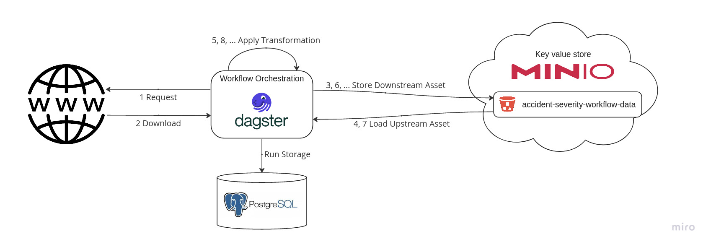
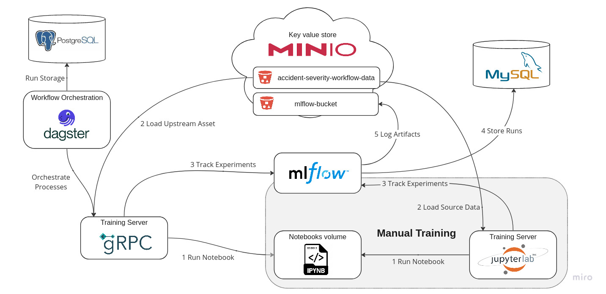
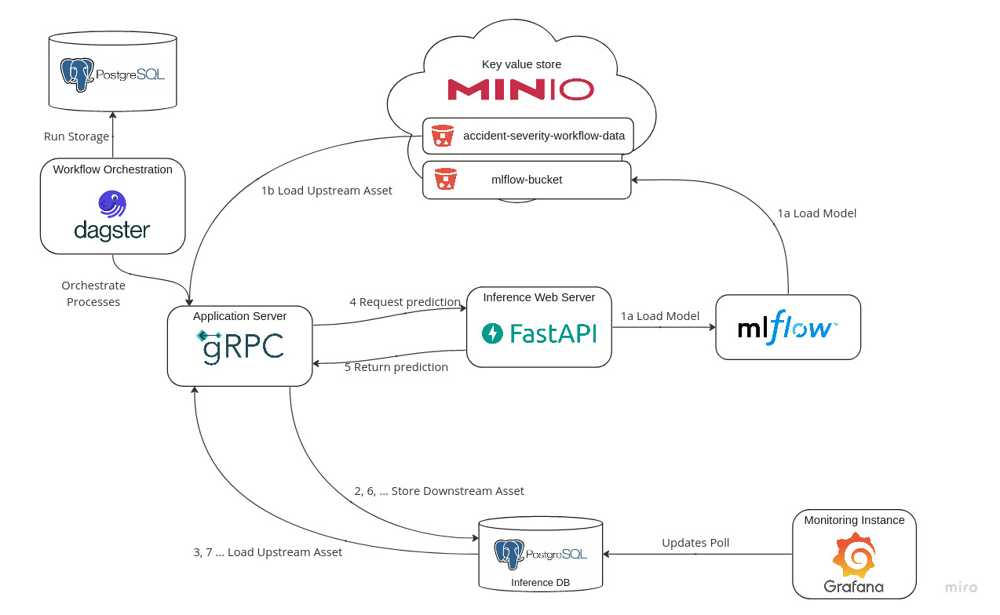

# System Architecture

## General

In order to make individual functionalities exchangeable, each component is deployed as a configurable
Docker container.

While in the current state of the project,the components are running locally, it is possible to replace them by cloud components.

## Scenario workflows

### Ingestion Workflow

The ingestion workflow consists of

- dagster webserver & dagster daemon containers handling the ingestion jobs and transformation and orchestration
- PostgreSQL as storage for dagster run information
- MinIO to minic AWS S3 storage (equivalent to the specific localstack service)

### Training Workflow

The training workflow consists of

- manual training environment:

  - Jupyter training web server
  - Volume containing the notebooks

- training workflow environment:
  - dagster webserer & dagster daemon for orchestration
  - PostgreSQL as storage for dagster run information
  - gRPC server for running training jobs defined in the notebooks volume

Botch sub-workflows require

- MLflow server for experiment tracking
- MinIO to minic AWS S3 storage to persist assets and model artifacts
- MySQL as MLflow backend store

### Simulation Workflow

The simulation workflow consists of

- gRPC server for running inference and monitoring jobs
- dagster webserer & dagster daemon for orchestration
- PostgreSQL as storage for dagster run information
- Web server for model inference
- Mlflow for loading model artifacts
- MinIO to minic AWS S3 storage to persist assets and model artifacts
- PostgreSQL as storage for inference and performance metrics
- Grafana server loading the performance metrics and its visualization
